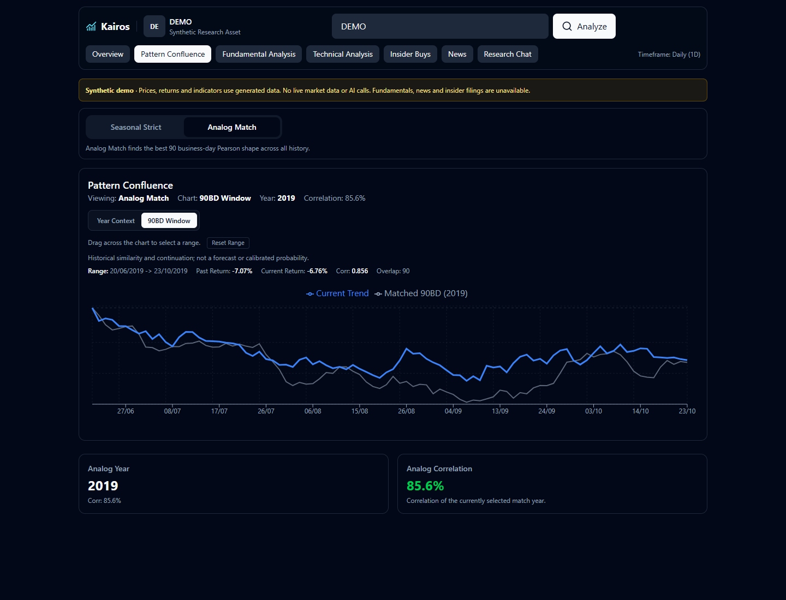

# Kairos

[](https://github.com/DavideWasTaken/Kairos/actions/workflows/checks.yml)

**A financial research dashboard that brings price patterns, company fundamentals and traceable calculations into one workspace.**

Kairos is a personal exploration of financial data and software architecture: a Python analysis engine, a React interface, and a constrained chat layer. It helps inspect the evidence behind a metric and compare different views of an asset. It has no validated trading edge or calibrated return forecasts.



## What you can explore

- **Historical patterns:** compare the latest price window with similar past windows, including a separate seasonal match. See what followed the historical match, with the dates visible.
- **Company analysis:** financial trends, valuation scenarios, analyst revisions and a breakdown of data availability.
- **Technical context:** moving averages, RSI, MACD and volume indicators calculated from OHLCV history.
- **Insider activity:** explicitly identified purchases, with reported dates, shares and values where available.
- **Research Chat:** ask about returns, correlations, insider activity or the asset analysis you just opened. Optional AI interprets questions and comments on retrieved evidence; numerical results remain calculated and formatted by code.

## Try it without API keys

Docker Compose starts in **synthetic demo mode** by default:

```sh
docker compose up --build
```

Open [localhost:8080](http://localhost:8080), then choose **Explore synthetic demo**. The `DEMO` and `DEMO2` assets use deterministic generated prices and volumes. Pattern matching, technical calculations and supported chat metrics run locally against those fixtures. Company fundamentals, news and insider data remain unavailable rather than being invented.

Demo mode makes no market-data or model requests. Its historical dates and prices are deliberately fixed; they are not current quotes. Stop with `docker compose down`.

### Local development

Requires Python 3.13 and Node.js 22. From the repository root:

```sh
python -m venv .venv
# macOS/Linux: source .venv/bin/activate
# PowerShell:  .\.venv\Scripts\Activate.ps1
python -m pip install -r backend/requirements-dev.txt
```

Copy `backend/.env.example` to `backend/.env`, then start the API:

```sh
cd backend
python -m uvicorn main:app --reload --host 127.0.0.1 --port 8000
```

In another terminal:

```sh
cd frontend
npm ci
npm run dev
```

Open [localhost:5173](http://localhost:5173). The Vite proxy sends `/api` requests to the local backend. API documentation is at [localhost:8000/docs](http://localhost:8000/docs).

### Use live data

Set `KAIROS_DEMO=0` in `backend/.env` for local development. With Docker, copy the root `.env.example` to `.env`, change the same setting, and recreate the containers.

Live mode uses Yahoo Finance through `yfinance` and public endpoints, plus public news/social sources where available. Coverage, rate limits and missing data affect the results. Respect the providers' terms; this repository does not distribute their datasets.

### Enable the optional AI assistant

Create your own key in [Groq Console](https://console.groq.com/keys). Set these backend variables, then restart the API (or recreate the Docker containers):

```dotenv
KAIROS_DEMO=0
GROQ_API_KEY=your-key-here
GROQ_MODEL=openai/gpt-oss-20b
```

Use `backend/.env` for local development or the root `.env` for Compose. Keep your real key out of Git and frontend variables. Each installation uses its operator's key and provider quota. The [default model supports structured responses](https://console.groq.com/docs/model/openai/gpt-oss-20b); `GROQ_MODEL` can select another compatible Groq model available to your account.

The assistant has two bounded stages:

1. **Interpret the request:** propose one operation with validated parameters. Only supported calculations and cached asset context can run.
2. **Explain the evidence:** generate commentary from the resulting source records, with references to their IDs. The computed answer and original facts remain separate.

General educational questions can produce an AI explanation without financial source records. Return and correlation calculations currently accept whole-year periods; unsupported requests ask for clarification instead of silently substituting another period.

For a dashboard summary, first analyze an asset and then ask about it in Research Chat. The backend uses its own recent analysis snapshot, including the selected DCF profile, data dates and missing fields. It does not trust browser-supplied financial figures.

Without a key, the deterministic research queries still work. Demo mode never calls Groq, even when a key exists. The interface distinguishes a configured key from a successful AI response and reports provider failures without exposing credentials. Configured does not mean the key or model has been tested online.

With AI enabled, your current question, bounded recent chat history, asset context and selected source records are sent to Groq. Review [Groq's data handling](https://console.groq.com/docs/your-data) before submitting confidential information. At most two model calls are made per turn; failed or invalid model responses fall back to the available deterministic behavior.

| Variable | Purpose |
| --- | --- |
| `KAIROS_DEMO` | `1` for synthetic, offline fixtures; `0` for live providers |
| `ALLOWED_ORIGINS` | Explicit allowed browser origins |
| `GROQ_API_KEY`, `GROQ_MODEL` | Optional question interpretation and evidence-based AI commentary |
| `BACKEND_WORKERS` | Keep `1` for the process-local analysis snapshot cache |
| `VITE_API_URL` | Frontend API base, normally `/api` |
| `VITE_PROXY_TARGET` | Local development backend, default `http://localhost:8000` |
| `FRONTEND_PORT`, `BACKEND_PORT` | Docker host ports, default `8080` and `8000` |

## How it is built

```text
React + Recharts
      | /api
      v
FastAPI
      +-- Historical pattern engine (NumPy / pandas)
      +-- Fundamental, technical and insider calculations
      +-- Optional validated AI request -> deterministic calculations
      +-- Recent server analysis -> source records -> optional AI commentary
      +-- Data source: synthetic fixtures OR live providers
```

Docker serves the frontend through Nginx and runs the API with Uvicorn. Local environment files are loaded by the backend; process variables take precedence.

## Reading the results honestly

**Pattern similarity is descriptive.** The engine searches many historical windows using Pearson correlation of price levels. A strong match can happen by chance. The displayed continuation is what followed a past window, not a forecast. There is no out-of-sample validation, transaction-cost model or strategy backtest.

**The composite score is a heuristic.** Its weights and thresholds are hand chosen. Missing components appear as unavailable; partial scores use disclosed neutral imputation. A score is not a probability or a measure of predictive accuracy. Demo mode omits the composite entirely.

**Valuations are scenarios.** DCF estimates depend on projected cash flow, discount rates, terminal growth, shares and debt. The interface exposes assumptions and missing inputs. They are not independently validated fair values.

**Verified facts means computed from the retrieved inputs.** It does not certify the provider's accuracy or completeness. Insider summaries cover available records and the scanned universe, not every market transaction. See [methodology and limitations](docs/METHODOLOGY.md).

**AI commentary is generated interpretation.** Validating a response's format and references cannot prove its claims are correct. A cited record can still be misinterpreted. Check the separate source records and calculated answer, especially when inputs are missing or stale.

## Checks

```sh
python -m unittest discover -s tests -v
python -m compileall -q backend
cd frontend
npm test
npm run lint
npm run build
npm audit --audit-level=high
```

The regression suite uses synthetic or mocked inputs: numerical edge cases, validated AI plans, evidence references, provider failures, snapshot provenance, API demo isolation and frontend presentation. CI runs these checks. Mocked AI tests verify integration behavior; they do not measure the live model's quality, certify provider availability or establish investment performance.

## Scope

Designed for local research and demonstration. Compose binds host ports to loopback. Authentication, per-user isolation and rate limiting are not implemented; add them before exposing an instance to other users. Keep credentials in ignored environment files. Nothing here places trades.

Analysis snapshots live in a bounded, expiring in-memory cache. Use one backend worker as configured by default. Restarting clears the cache; multiple workers or replicas need a shared cache for reliable dashboard context. Re-analyze the asset when its snapshot is unavailable.

## License

[MIT](LICENSE) · Built by [Davide Gaglione](https://davide.sh).
